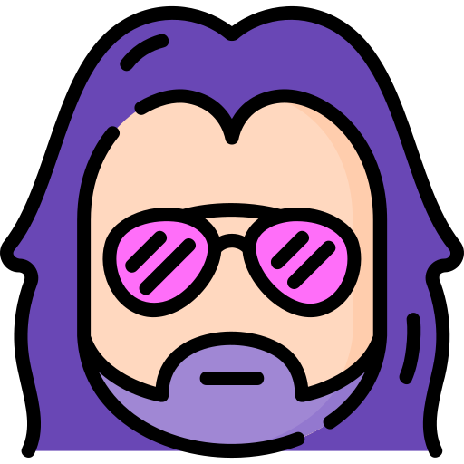

  
   
  <h1>THIERRY</h1>
  <blockquote>
  
Django backend for Jean Baptiste Show website

  </blockquote>
   
  
  
   
  
  
  
   
   
   
  
   
   
   
  

    

      
      
    

    

      
      
    

    

      
      
    

  

---

## Requirements
- poetry
- docker (with docker-compose)
- python ^3.10
- make

## Stack
- backend server: Django + Django Rest Framework
- database: Postgres
- cache: Redis

## Development
Copy `.env.example` to `.env.dev` and [get a Youtube API Key](https://console.developers.google.com). Add the key to `.env.dev`.

> `app/` folder in mounter in web container so you can have hot reload while running code in docker

Default user:password for http://localhost:8000/admin is `admin:admin`

Then, the make file provide shortcuts for regular actions:
- `make dev`: up docker-compose
- `make updatedebriefs`: sync debriefs with database
- `make test`: run tests
- `make pre-commit` run pre-commit on all files (good to run before committing)
- `make stop`: down docker-compose
- `make stop-clean`: down docker-compose and remove volumes and possible orphans containers
